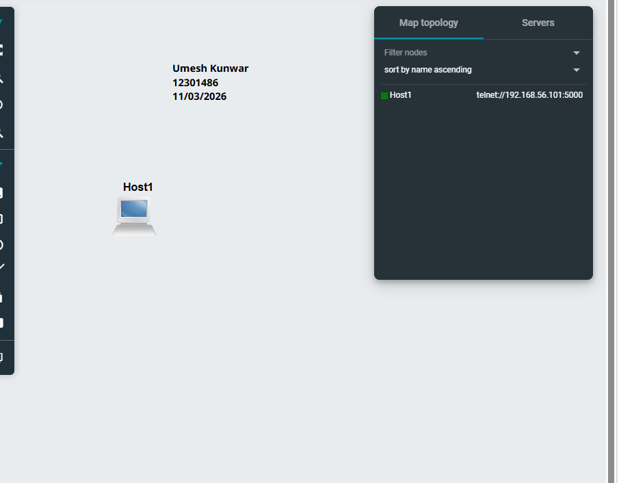
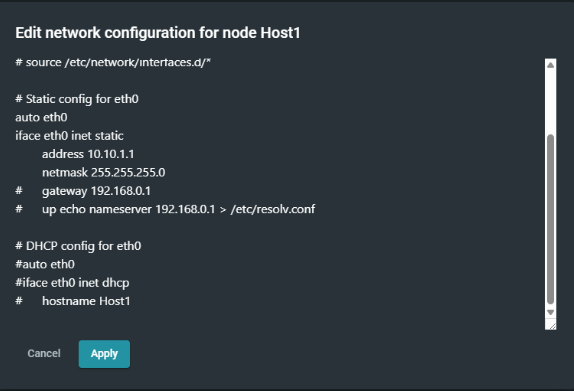

# Network Configuration Project (GNS3)

**Umesh Kunwar**  
Student ID: 12301486  
subject:COIT12206 Sydney 
Date: 15/03/2026  

---

## Project Overview
This project demonstrates basic network configuration using GNS3 and Linux systems. It includes setting up a host, assigning a static IP address, and verifying connectivity through terminal commands.

---

## 1. Network Topology


### Description:
This is the initial setup of the network in GNS3.  
A single host (Host1) is added to the topology.  
This step helps in understanding how to build and manage network devices in a virtual environment.

---

## 2. Project Creation in GNS3


### Description:
A new project named **GNS-intro-12304055** was created in GNS3.  
This is the starting point where all configurations and experiments are performed.

---

##  3. Network Configuration (Static IP)


### Description:
The network interface file `/etc/network/interfaces` was edited to assign a static IP address.

Configuration used:
```bash
auto eth0
iface eth0 inet static
    address 10.10.1.1
    netmask 255.255.255.0
    gateway 192.168.0.1
