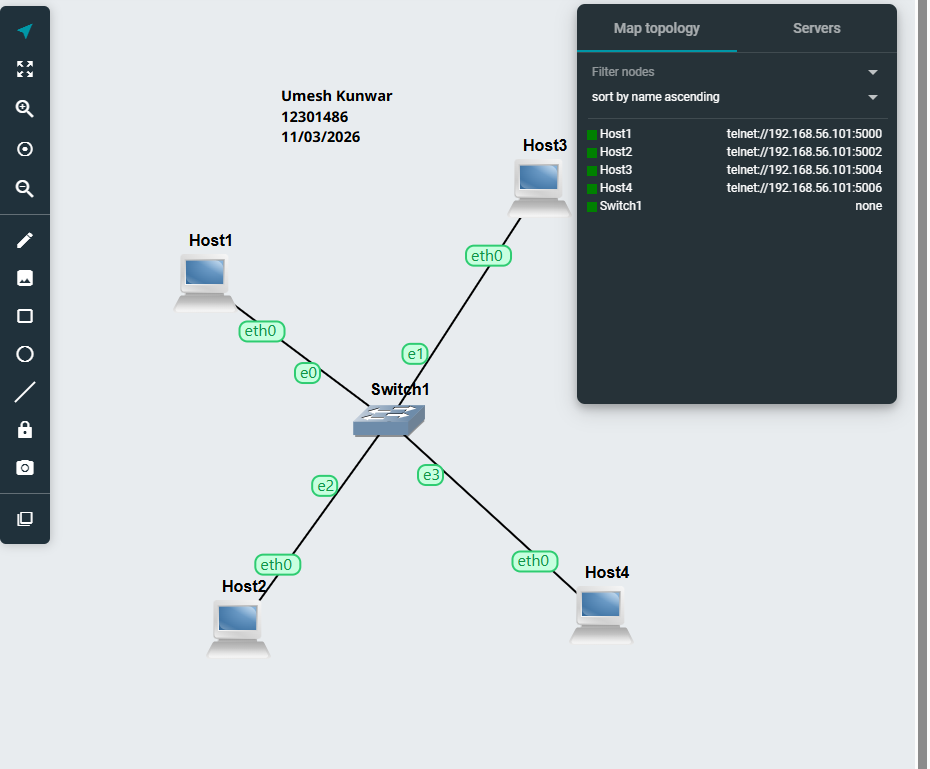
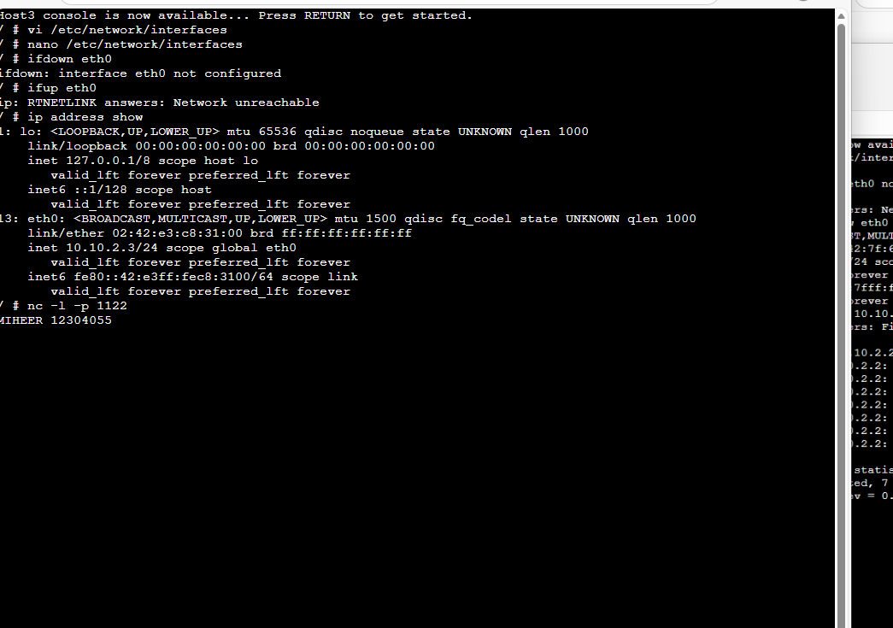
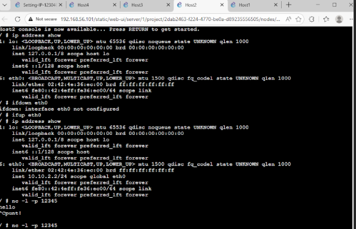
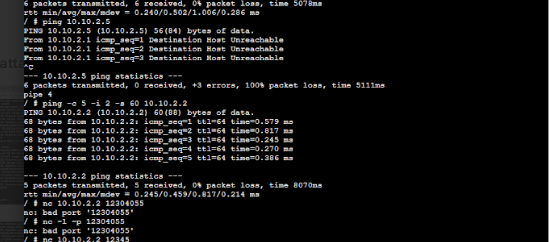
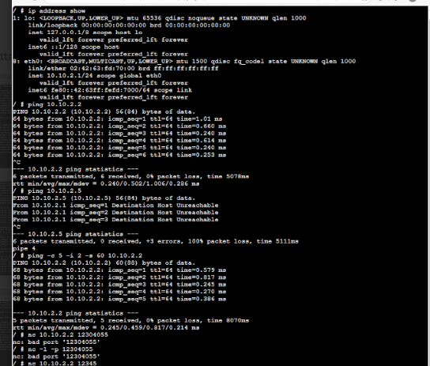
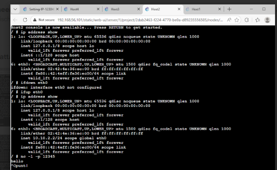
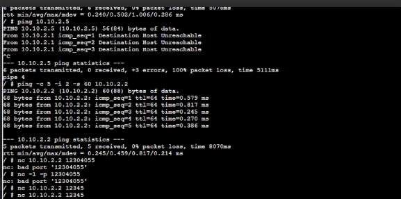

# GNS3 Multi-Host Network Configuration Project

##  Author
**Umesh Kunwar**  
Student ID: 12301486  
Subject:COIT12206 Sydney
Date: 15/03/2026  

---

##  Project Overview
This project demonstrates a multi-host network configuration using GNS3.  
Four hosts are connected through a switch, configured with static IP addresses, and tested for connectivity using Linux networking commands.

---

##  1. Network Topology






### Description:
The network consists of:
- 4 Hosts (Host1, Host2, Host3, Host4)
- 1 Switch (Switch1)

Each host is connected to the switch using Ethernet interfaces.  
This setup represents a basic LAN (Local Area Network).

---



##  2. Project Creation


### Description:
A new project was created in GNS3.  
This step initializes the workspace where all devices and configurations are added.

---

##  3. Host Configuration (Static IP)


### Description:
Each host was configured with a static IP address by editing:

```bash
/etc/network/interfaces
auto eth0
iface eth0 inet static
    address 10.10.2.x
    netmask 255.255.255.0
ip address show
ping 10.10.2.2
ping 10.10.2.5
nc -l -p 12345
echo "hello" | nc <IP_ADDRESS> 12345


