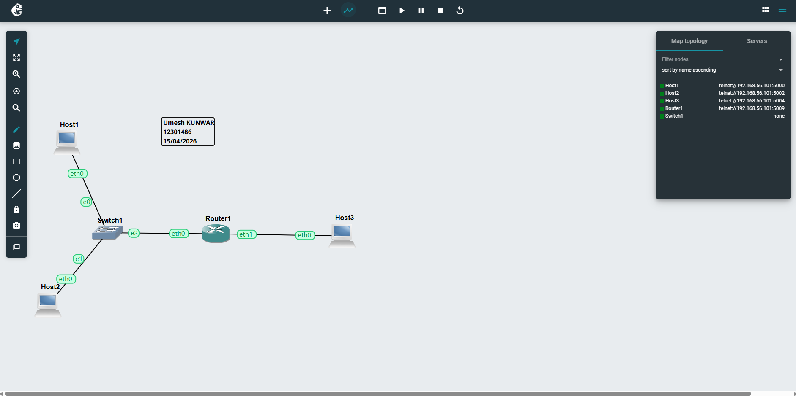
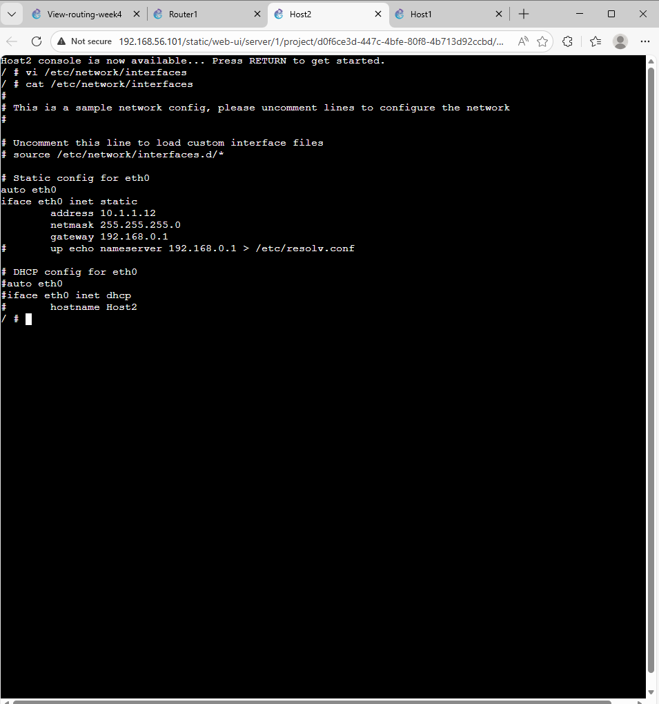
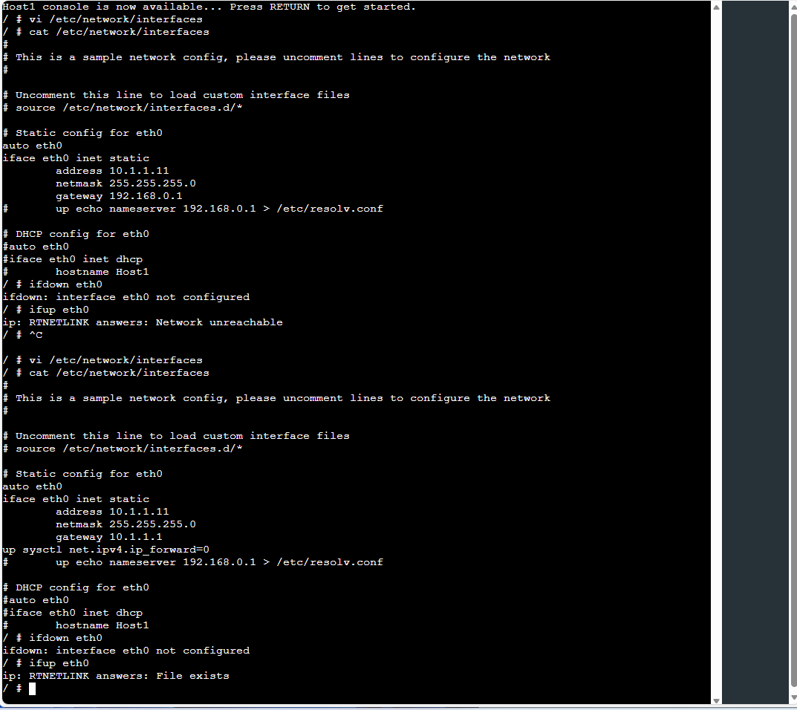
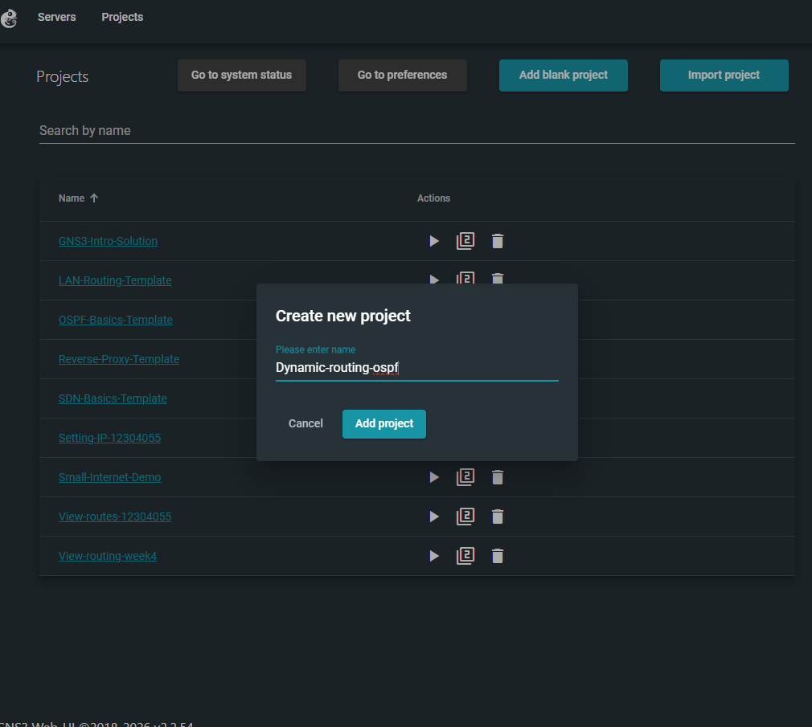
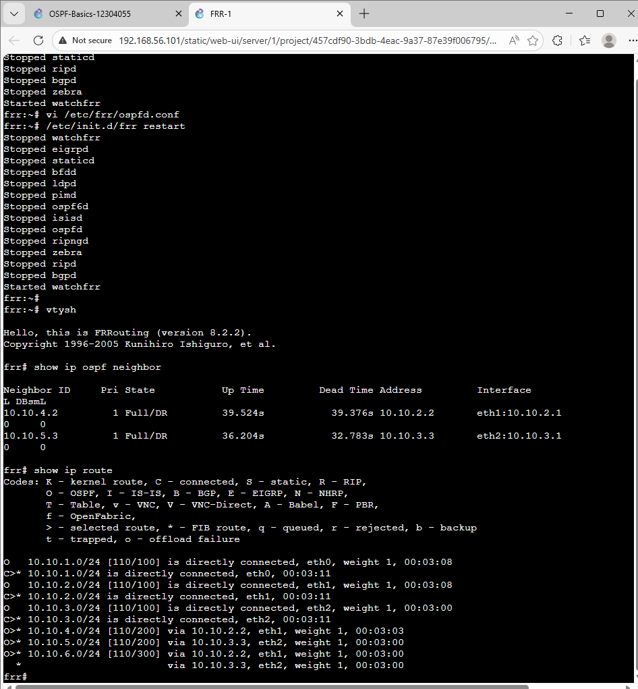
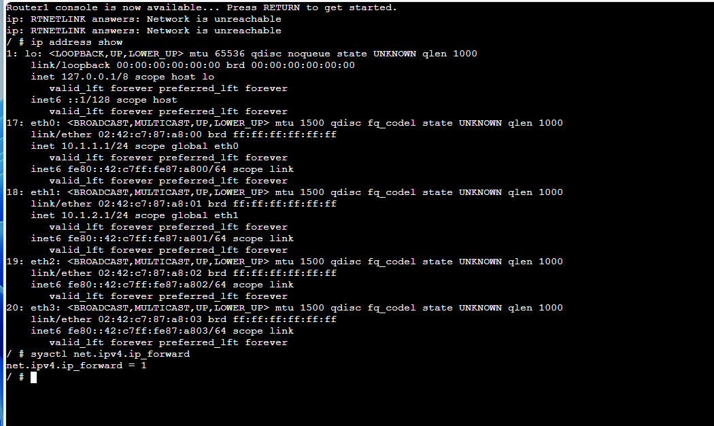
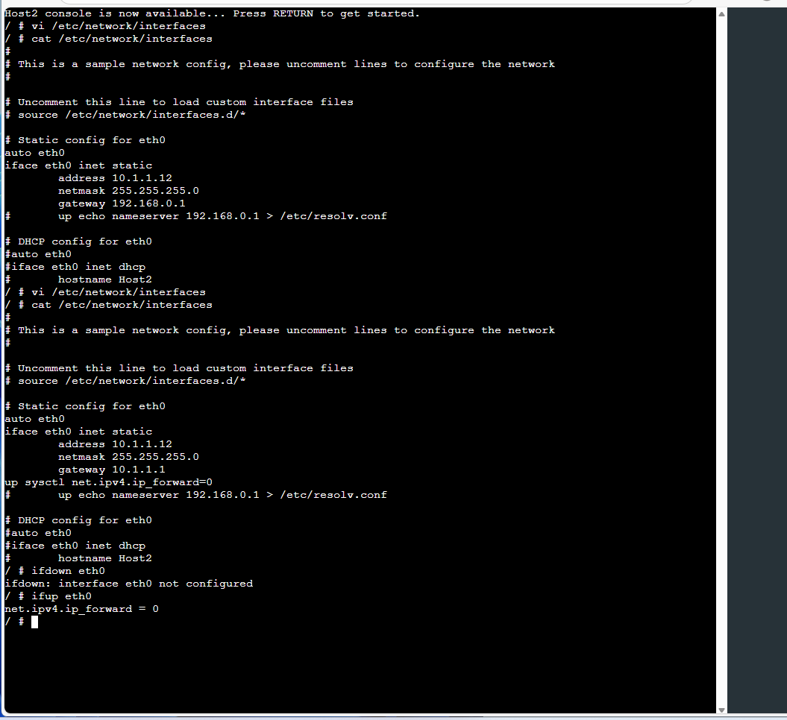
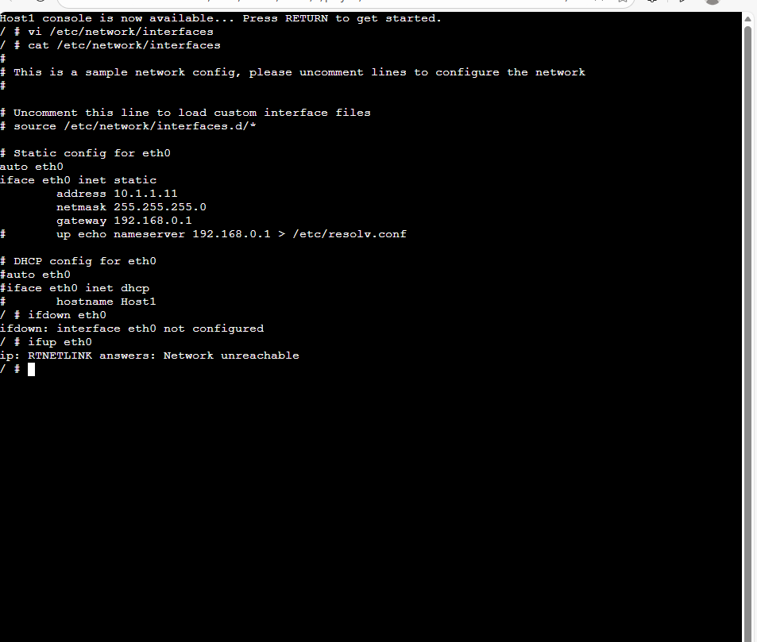

# OSPF Routing Configuration Project (GNS3 + FRR)

## Author
**Umesh Kunwar**  
Student ID: 12301486  
Subject:COIT12206 Sydney
Date: 15/03/2026  


---

## Project Overview
This project demonstrates routing configuration using **OSPF protocol** in GNS3 with FRRouting (FRR).  
Multiple hosts and a router are configured to communicate across different networks using dynamic routing.

---

##  1. Network Topology




### Description:
The network consists of:
- Multiple Hosts (Host1, Host2, Host3)
- One Router (FRR)
- Different subnets:
  - 10.1.1.0/24
  - 10.1.2.0/24

All devices are connected through the router to enable inter-network communication.

---




## Router Configuration


## ping connectivity(ping 10.1.1.1)


## Task 2 



##  2. FRR OSPF Configuration
Show ip ospf neighbor




### Description:
FRR daemons were configured to enable OSPF routing.

Important settings:
- `ospfd=yes` → Enables OSPF daemon
- `zebra=yes` → Enables routing manager

This allows dynamic route exchange between networks.

---

## 3. Host 1 Configuration


### Description:
Host1 was configured with static IP:






```bash
address 10.1.1.11
netmask 255.255.255.0
gateway 10.1.1.1
address 10.1.1.12
gateway 10.1.1.1
sysctl net.ipv4.ip_forward=1
ip address show
ping 10.1.1.1
ping 10.1.1.12
ping 10.1.2.11

