# VLAN Configuration using Open vSwitch (GNS3)

## Author
**Umesh Kunwar**  
**Student ID:** 12301486  
**Subject:** COIT12206 Sydney  
**Date:** 15/03/2026  

---

## Project Overview
This project demonstrates VLAN configuration using Open vSwitch (OVS) in GNS3. The network is divided into multiple VLANs to isolate traffic, and inter-VLAN communication is achieved through a router. This project helps demonstrate practical networking concepts such as VLAN tagging, trunking, traffic isolation, and routing between different VLANs.

---

## 1. Network Topology
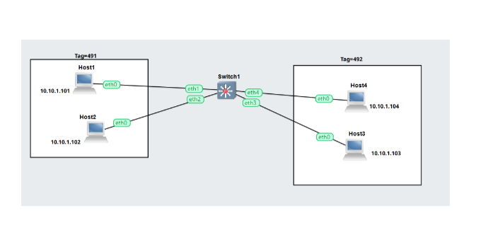
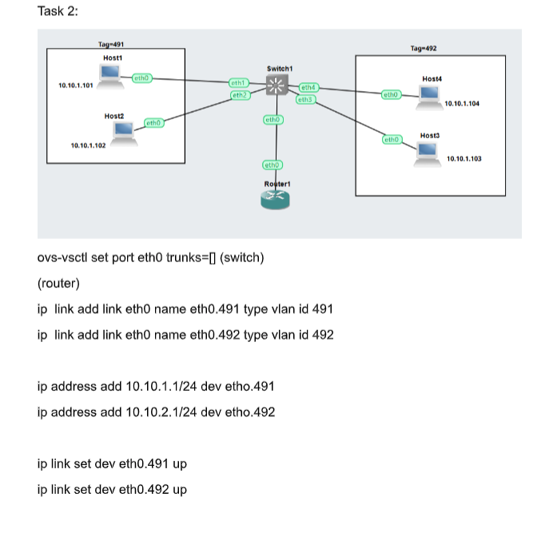

### Description
The network topology consists of four hosts connected to an Open vSwitch. The hosts are divided into two VLAN groups:

- **VLAN 491** → Host1, Host2  
- **VLAN 492** → Host3, Host4  

Although all hosts are physically connected through the same switch, VLAN tagging separates them into different logical networks. This means that devices in one VLAN cannot directly communicate with devices in another VLAN unless a router is configured for inter-VLAN routing.

---

## 2. Initial Configuration Steps
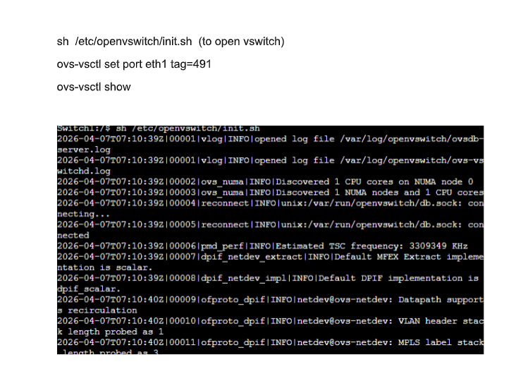
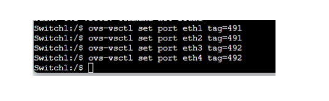
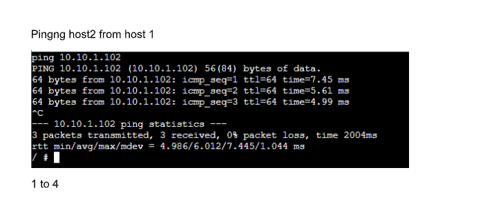

### Description
These screenshots show the initial preparation of the network devices. Static IP addresses are assigned to the hosts, and the network settings are configured through the Linux network interface files. This step is important because proper IP addressing and gateway configuration are required before VLAN communication can be tested.

---

## 3. Task 2 Topology with Router


### Description
In this stage, a router is added to the topology to allow communication between the two VLANs. VLANs are isolated broadcast domains, so devices in VLAN 491 cannot communicate with devices in VLAN 492 without routing. The router acts as the Layer 3 device that forwards packets between the VLANs.

---

## 4. Host Configuration
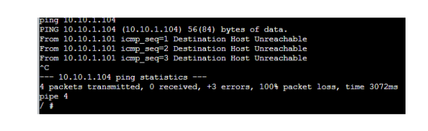
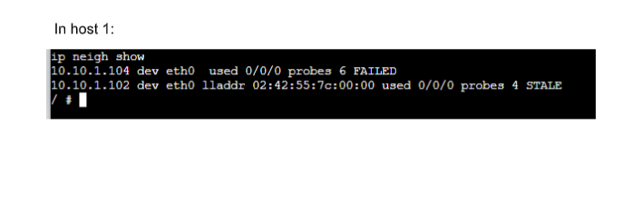
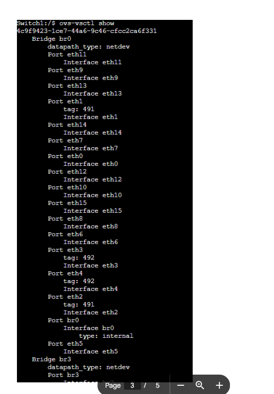
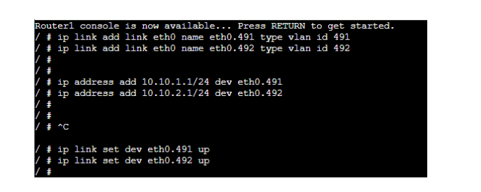
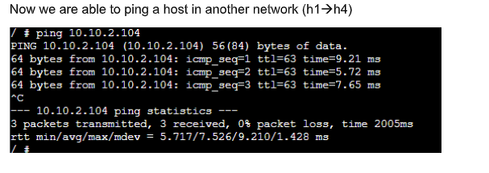
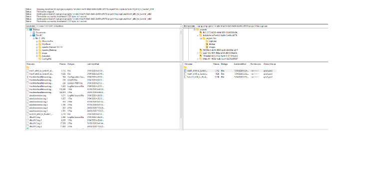

### Description
These screenshots show the static IP configuration of the hosts. Each host is assigned:

- An IP address  
- A subnet mask  
- A default gateway  

This configuration ensures that hosts in the same VLAN can communicate directly, while traffic destined for another VLAN is forwarded to the router.

---

## 5. Open vSwitch Initialization


### Description
Open vSwitch is initialized to function as the virtual switch in this network. The following command is used to start OVS:

```bash
sh /etc/openvswitch/init.sh
ovs-vsctl set port eth1 tag=491
ovs-vsctl set port eth2 tag=491
ovs-vsctl set port eth3 tag=492
ovs-vsctl set port eth4 tag=492
ping 10.10.1.102
ip neigh show
ip link add link eth0 name eth0.491 type vlan id 491
ip link add link eth0 name eth0.492 type vlan id 492
ip address add 10.10.1.1/24 dev eth0.491
ip address add 10.10.2.1/24 dev eth0.492
ip link set dev eth0.491 up
ip link set dev eth0.492 up
ping 10.10.2.104
