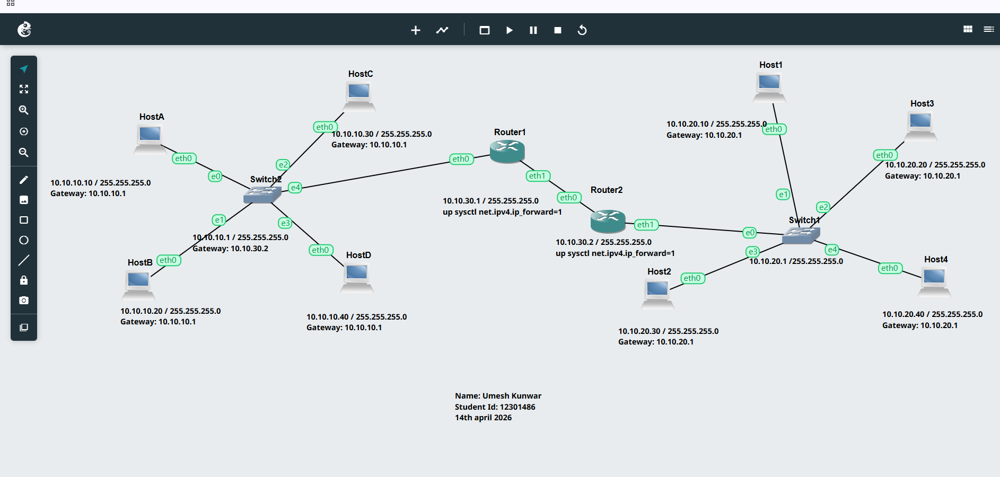
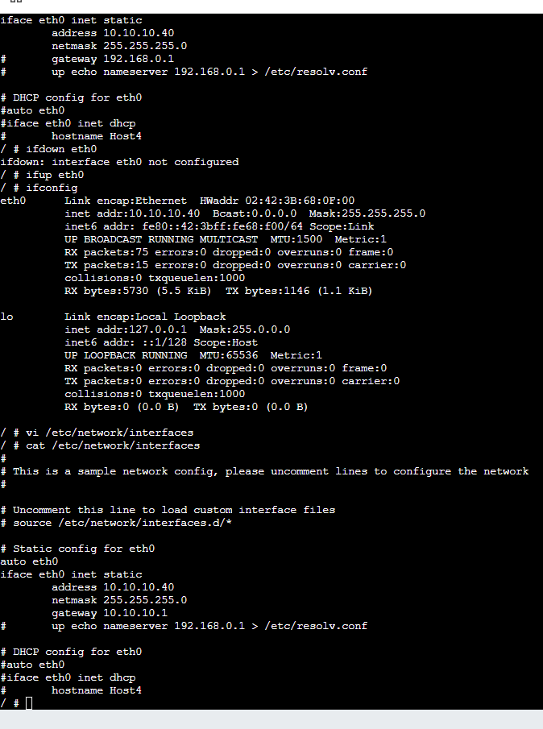

# Enterprise Network Configuration Project (GNS3)

##  Author
Umesh Kunwar  
Student ID: 12301486  
Date: 14 April 2026  

---

## Project Overview
This project demonstrates a multi-network enterprise topology using GNS3.  
It includes multiple hosts, switches, and routers connected across different subnets with proper routing and communication.

---

##  1. Network Topology


### Description:
This topology includes:
- Multiple Hosts (HostA, HostB, HostC, HostD, Host1–Host4)
- Two Routers (Router1 and Router2)
- Two Switches
- Two networks:
  - 10.10.10.0/24
  - 10.10.20.0/24
- Router interconnection network:
  - 10.10.30.0/24

This setup simulates a real-world enterprise LAN with routing between networks.

---


ping 10.10.10.20
ping 10.10.10.30

##  2. Host Configuration

###  Host A Configuration

Configured with:
- IP: 10.10.10.10
- Gateway: 10.10.10.1

---

###  Host B Configuration


Configured with:
- IP: 10.10.10.20
- Gateway: 10.10.10.1

---

###  Host C Configuration

Configured with:
- IP: 10.10.10.30
- Gateway: 10.10.10.1

---

###  Host D Configuration


Configured with:
- IP: 10.10.10.40
- Gateway: 10.10.10.1

---

##  3. Router Configuration

###  Router 1



Configured interfaces:
- 10.10.10.1 → LAN
- 10.10.30.1 → Inter-router link

Enabled IP forwarding:
```bash
sysctl net.ipv4.ip_forward=1
ip address show
ping 10.10.10.20
ping 10.10.10.30

